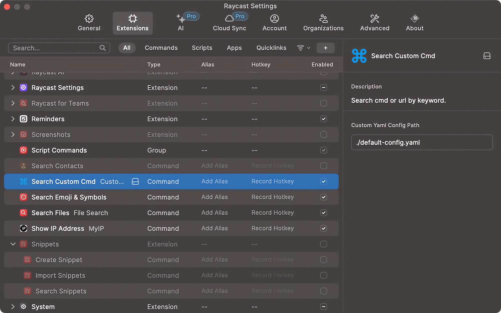

# Custom Command Search

You can customize commonly used URLs or commands, and then use this plugin for quick access. This plugin can be very useful in situations where a platform provides multiple environments.

Then You can use the yaml path in the custom command file for multi device synchronization



## Install
```shell
git clone git@github.com:mrdear/custom-command-search-raycast.git

cd custom-command-search-raycast

npm install

ray build
```

## config file example

- tags：Extra identification during search
- values：Various instructions in the current key
- {clip_0}：The first data of the pasteboard

```yaml
- key: ss
  remark: Search Engine
  tags: sousuo,baidu,duoji
  values:
    - cmd: https://www.baidu.com/s?wd={clip_0}
      remark: Baidu search
    - cmd: https://www.google.com/search?q={clip_0}
      remark: Google search
```
